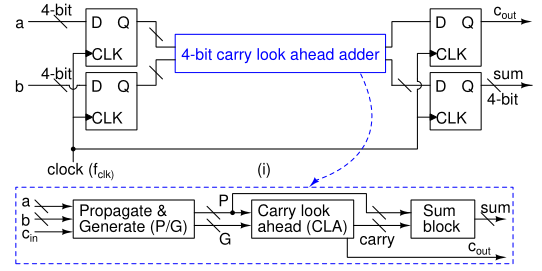

# **4-bit Carry Lookahead Adder (CLA)**

This repository contains the following implementations and files related to a **4-bit Carry Lookahead Adder**:



## **Features**
- **Pre-Layout and Post-Layout Simulations:**
  - NGSPICE simulations for functional verification.
  - Magic VLSI layouts for adder designs.
  - Static Timing Analysis using NGSPICE.

- **Verilog Implementation:**
  - Structural descriptions of the 4-bit CLA.
  - Testbenches for functionality verification.

- **FPGA Implementation:**
  - Constraint files (`.xdc`) for Field Programmable Gate Array (FPGA) implementation.
  - Other necessary files for hardware realization using an FPGA.

## **Tools Used**
- **Simulation:** NGSPICE + Verilog HDL
- **Layout Design:** MAGIC VLSI
- **Hardware Description:** Verilog HDL
- **FPGA Tools:** Xilinx Vivado

## **Getting Started**
1. **Clone the Repository:**
   ```bash
   git clone git@github.com:<username>/4-bit-CLA.git
   cd 4-bit-CLA
   ```

2. **Simulate the Design:**
   - Use NGSPICE to run pre-layout or post-layout simulations.
   - Open `*.sp` files to verify design performance.

3. **Run Verilog Simulations:**
   - Use tools like GTKWave or Vivado for simulation.
   - Execute testbenches to check the Verilog implementation.

4. **Implement on FPGA:**
   - Load the `.xdc` constraint files and Verilog design into Xilinx Vivado.
   - Generate the bitstream and program your FPGA.

## **Contributing**
Feel free to contribute by:
- Reporting issues.
- Enhancing the implementation or documentation.
- Adding support for additional tools or platforms.

---
